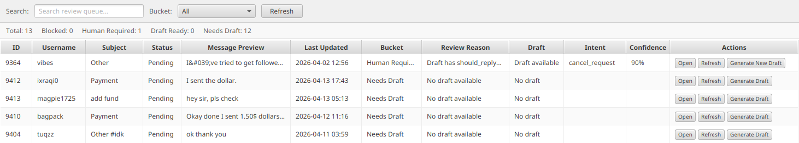
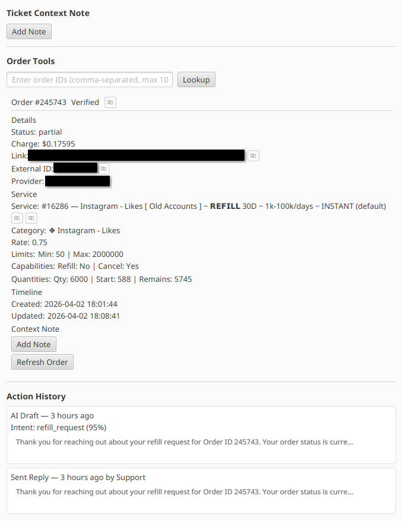
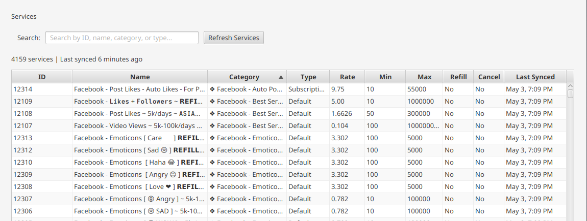
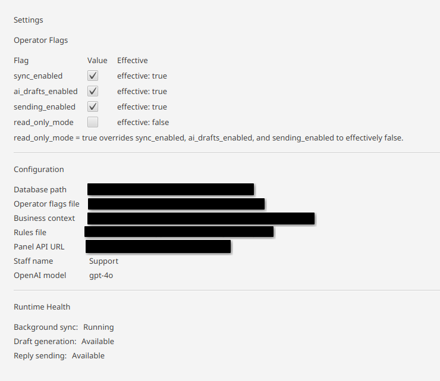
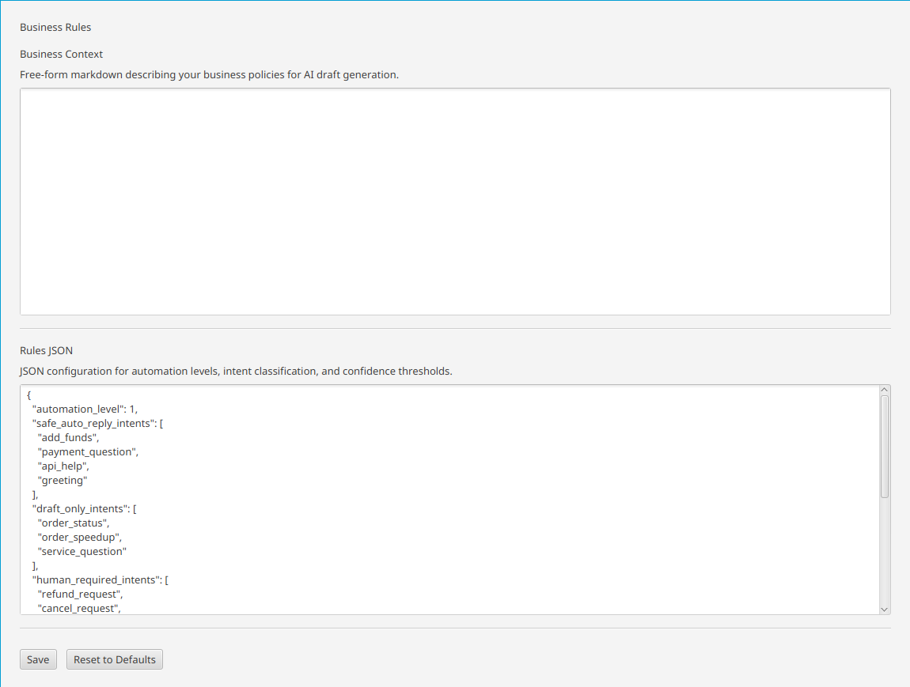

# Relay ASA

**Automated Support Assistant — a desktop ticket management tool with AI-assisted drafting.**

---

## Screenshots

| Review Queue |
|:---:|
|  |

| Ticket & Order Tools |
|  |

| Service Catalog |
|:---:|:---:|
|  |

| Settings |
| |

| Business Rules |
|:---:|
|  |

---

## What This Is

I run an SMM panel and handle customer support tickets daily. The built-in admin tool had no conversation history, no draft assistance, no way to verify order ownership before responding, and no protection against duplicate or stale replies.

I built Relay ASA to fix that. It's a JavaFX desktop app that syncs tickets from an external panel API, stores the full conversation history locally in SQLite, generates AI draft replies via OpenAI, and enforces a human-in-the-loop approval before anything is sent. Every design decision prioritizes safety — replies are customer-facing and irreversible, so the system is built to fail closed rather than fail open.

---

## Skills Demonstrated

| Area | What I Built |
|------|-------------|
| **Java 21** | Full application — 267 source files, immutable domain records, sealed types, structured concurrency |
| **JavaFX** | 7-workspace desktop UI with navigation routing, state management, lifecycle hooks, async data loading |
| **SQLite + Flyway** | 12-table schema across 9 migrations with idempotent upserts, foreign keys, and retention cleanup |
| **API Integration** | 3 external APIs (REST) with OkHttp — rate limiting, retry with backoff, error diagnostics |
| **OpenAI API** | Structured JSON output via Responses API with prompt engineering, intent classification, and safety filtering |
| **Testing** | 93 tests — JUnit 5, Mockito, MockWebServer for HTTP, injectable clocks for deterministic time tests |
| **Security Engineering** | Ownership verification, duplicate protection, stale-data rejection, fail-closed config, kill switches |
| **Documentation** | 11 canonical docs maintained in sync with code through a docs-guardian workflow |

---

## What It Does

- **Syncs tickets** from an external panel API with background polling, rate limiting, and priority queuing
- **Stores full conversation history** locally with raw JSON retention for debugging and recovery
- **Generates AI drafts** with intent classification, confidence scoring, and reply suppression for high-risk messages
- **Enforces fresh data** before every view, draft, and send — the app never acts on stale state
- **Verifies order ownership** before displaying, persisting, or passing order details to AI
- **Protects against duplicate replies** and stale-context sends
- **Provides operator controls** — independent kill switches for sync, AI, and sending, plus a dominant read-only mode
- **Supports agent context** — per-ticket and per-order notes that enrich AI drafts without being echoed to customers

---

## Engineering Highlights

- **Safety-first architecture** — human approval required for every outbound reply; fail-closed defaults if config is corrupted
- **Layered design** — clean separation between UI, service, repository, and API layers with no circular dependencies
- **Documentation-driven development** — every feature starts with a doc update; 11 canonical docs stay in sync with code
- **Built through a 22-step implementation checklist** — each step scoped, tested, verified, and reviewed before moving on
- **Comprehensive testing** — MockWebServer for real HTTP testing, injectable clocks for time-dependent behavior, deterministic AI evals
- **Designed for evolution** — V1 is conservative (no auto-send), but module boundaries support future automation without rewiring

---

## Tech Stack

| | |
|---|---|
| **Language** | Java 21 |
| **UI** | JavaFX 21 |
| **Database** | SQLite + Flyway |
| **HTTP** | OkHttp 4.12 |
| **JSON** | Jackson 2.17 |
| **AI** | OpenAI Responses API (structured output) |
| **Logging** | SLF4J + Logback |
| **Testing** | JUnit 5 + Mockito + MockWebServer |

---

## Project Stats

| Metric | Count |
|--------|-------|
| Source files | 267 |
| Tests | 93 |
| Database tables | 12 |
| Database migrations | 9 |
| API integrations | 3 |
| UI workspaces | 7 |
| Documentation files | 11 |
| Commits | 64 |

---

## Documentation

The `docs/` directory contains the full technical documentation for the project. These are the same canonical docs used during development — not afterthoughts.

| Document | Topic |
|----------|-------|
| [System Design](docs/SYSTEM_DESIGN.md) | Goals, constraints, tradeoffs |
| [Architecture](docs/ARCHITECTURE.md) | Modules, data flows, concurrency |
| [Database Schema](docs/DATABASE_SCHEMA.md) | Tables, relationships, retention |
| [API Integration](docs/API_INTEGRATION.md) | External API contracts and policies |
| [AI Behavior](docs/AI_BEHAVIOR.md) | Prompts, safety, intent taxonomy |
| [Automation Rules](docs/AUTOMATION_RULES.md) | Safety boundaries and kill switches |
| [Engineering Process](docs/ENGINEERING_PROCESS.md) | Development methodology |

---

## Roadmap

**V1.5** — Keyboard shortcuts, notification badges, bulk queue operations, full-text search, response templates, dark mode

**V2** — Browser automation, read/write order actions, provider monitoring, analytics dashboard, CI/CD

---

## Source Code

This is a showcase repository. The source code is in a private repo and available for walkthrough on request.

---

*All Rights Reserved. Documentation and design artifacts for portfolio purposes only.*
