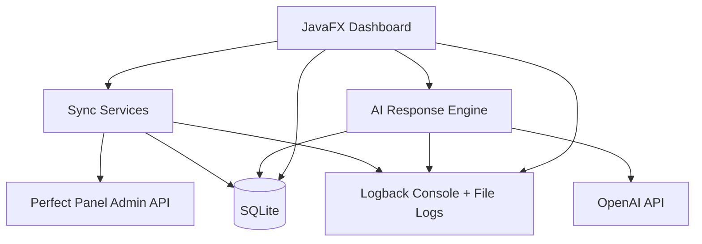

# Architecture

> Runtime topology, services, modules, components, interactions, data flow.

## 1. Runtime Topology

V1 is a single local JavaFX desktop process with local file resources and a local SQLite database.

## 2. Modules

| Module | Responsibility | Depends on |
| ------ | -------------- | ---------- |
| Application bootstrap | JavaFX app startup, env config, database migration, operator flags, knowledge seeding | JavaFX |
| Config | Environment configuration, operator flags persistence, knowledge file management with JSON validation and atomic writes | Environment variables, local JSON settings, classpath resources |
| API Models | Upstream API payload records for deserialization and serialization | Jackson |
| Domain Models | Immutable domain records for tickets, messages, attachments, AI logs, sent replies, orders, services | None |
| Repository | SQLite persistence with idempotent upserts for all domain entities, Flyway bootstrap, connection provider with foreign-key enforcement | SQLite, Flyway, Domain Models |
| Panel API Client | HTTP client for ticket list, ticket detail, order detail, and reply endpoints with checked exceptions | OkHttp, Jackson, API Models |
| Service API Client | HTTP client for service catalog fetch with row-by-row parsing and error isolation | OkHttp, Jackson, API Models |
| Sync Services | Ticket status classification, background list sync (60s scheduler), full ticket fetch, throttle-aware execution, priority queue consumption, fresh-fetch gate with sealed result types | Panel API Client, Repository, Rate Limiter |
| Rate Limiter | Token-bucket rate limiter (5 req/s) with injectable clock, throttle-back on HTTP 429, priority fetch queue with deduplication and priority promotion | `java.util.concurrent` |
| Review Queue | Precedence-ordered bucket classification (Blocked → Human Required → Draft Ready → Needs Draft), data assembly with safety policy applied | Repository, Sync, AI, Reply Services |
| AI Service | OpenAI Responses API client with strict structured output, retry with backoff, draft validation, safety policy, prompt assembly from templates and knowledge files, context note integration | OkHttp, Jackson, Repository, Config |
| Reply Service | Latest-customer-message lookup, duplicate detection, stale-context rejection, coordinated send flow with pre/post fresh fetch, sealed result types | Repository, Panel API Client, Sync |
| Close & Lock | Final message send, audit logging, local locked state persistence with idempotent recovery | Repository, Panel API Client, Sync, Reply |
| Cleanup | Raw payload retention cleanup with dual retention windows (180d/30d), transactional NULL-out, startup + daily scheduled passes | Repository, `java.util.concurrent` |
| Order Service | Deterministic order ID extraction with false-positive filtering, ownership gate, per-ID result states, structured logging | Panel API Client, API Models |
| Service Catalog | Catalog sync with full replacement, 24-hour stale detection, search, order-to-service enrichment | Service API Client, Repository |
| UI Navigation | Destination enum, sealed route types, observable navigation state, persistent navigation rail, workspace router with lifecycle hooks | JavaFX, Workspaces |
| UI Shell | Root layout assembling navigation rail and active workspace | JavaFX, Navigation |
| UI Workspaces | 7 swappable workspaces (Tickets, Review Queue, Answered/Completed, Services, Settings, Business Rules, Logs) plus Ticket Detail with three-pane layout | JavaFX, all services |
| UI State | Reusable view-state sealed type (Empty/Loading/Loaded/Error) and overlay component | JavaFX |
| Utilities | Text normalization, message/reply hashing, HTML entity decoding, timestamp formatting | None |

## 3. JavaFX UI Model

### 3.1 Primary Stage and Navigation

- One primary JavaFX stage for the normal operator workflow.
- Persistent navigation rail plus one active workspace pane.
- Top-level destinations: Tickets, Review Queue, Answered/Completed, Services, Settings, Business Rules, and Logs.
- Ticket Detail is an in-window routed workspace that replaces the current list workspace.
- Navigating back restores the originating screen with its filters, sort, selected row, and scroll position.

### 3.2 Top-Level Screens

| Screen | Purpose | Primary actions |
| ------ | ------- | --------------- |
| Tickets | Full searchable ticket corpus | Open ticket, manual refresh |
| Review Queue (default landing) | Prioritized operational subset needing attention | Open ticket, refresh row, generate/replace draft |
| Answered / Completed | Historical view of closed/answered/locked tickets | Open ticket, manual refresh |
| Services | Searchable service catalog | Search, refresh catalog |
| Settings | Operator control and environment info | Edit operator flags, view config |
| Business Rules | AI knowledge editing surface | Save, reset to defaults |
| Logs | Operational audit and troubleshooting | Category filters, refresh |

### 3.3 Review Queue Behavior

The review queue is derived runtime state, not a separate table. It is built from ticket records, message hashes, AI draft logs, send logs, and safety checks.

Queue membership precedence:

1. **Blocked** — fresh-fetch failure, malformed AI output, stale draft, duplicate-protection failure
2. **Human Required** — human-required intent, missing/low confidence, `should_reply=false`, operator escalation
3. **Draft Ready** — valid draft for latest customer message, no blocks
4. **Needs Draft** — no current valid draft, no blocks

Within each bucket, rows sort by newest customer activity first. Send is never available from the queue list — sending requires opening the full Ticket Detail view.

### 3.4 Ticket Detail Workspace

Opening Ticket Detail starts with a mandatory fresh fetch. Three-pane layout:

- **Left:** ticket metadata, status, timestamps, review bucket
- **Center:** full conversation history (scrollable) with selectable/copyable text and clickable URLs; pinned compose section at bottom with draft state, metadata, editor, and send controls
- **Right:** ticket context notes, Order Tools panel with ownership-gated lookup, and action history

Key workflow rules:
- Draft display states: No Draft, Ready for Review, Manual Handling Required, Outdated, Invalid AI Output, Generation Failed
- Compose auto-fill only when draft is fresh with `should_reply=true`
- Locally locked tickets disable all action controls
- Send triggers a second fresh fetch before duplicate protection runs
- Post-send re-fetch updates ticket state immediately

## 4. Data Flow

### 4.1 Startup

1. Resolve database path and environment configuration
2. Run Flyway migrations (with pre-migration backup for existing databases)
3. Run retention cleanup pass
4. Start background sync scheduler

### 4.2 Background Sync

1. 60-second scheduler calls ticket list endpoint
2. Metadata upserted into SQLite
3. Changed tickets queued for full fetch
4. User-triggered requests outrank background work via priority queue

### 4.3 Fresh Fetch Before Action

1. User opens a ticket, requests a draft, or sends a reply
2. App performs a fresh ticket detail fetch and updates local storage
3. UI renders from updated state
4. If fetch fails, the action remains blocked

### 4.4 AI Draft Generation

1. Fresh-fetch gate passes
2. Prompt assembled from conversation history, business rules, order context, and agent notes
3. OpenAI returns strict JSON (`response`, `confidence`, `intent`, `should_reply`)
4. Draft safety policy applied; result persisted
5. Operator reviews and edits before any send

### 4.5 Reply Send

1. Operator clicks send
2. Second fresh fetch runs
3. Stale-context check, duplicate protection, replyability verification
4. Reply sent via API
5. Immediate post-send re-fetch updates local state

## 5. Concurrency and Lifecycle

- `ScheduledExecutorService` for background polling (60s) and daily retention cleanup
- 2-thread sync lifecycle: one for list sync scheduler, one for fetch worker draining the priority queue
- Token-bucket rate limiter (5 permits/s) with injectable clock for testing
- Priority fetch queue with `ConcurrentHashMap` deduplication and user-triggered promotion
- Clean shutdown in JavaFX `Application.stop()` override

## 6. Configuration

- **Panel API:** URL and key from environment variables
- **OpenAI:** API key and model from environment variables
- **Service API:** optional URL and key; catalog sync disabled when absent
- **Database:** configurable path, defaults to `supportbot.db`
- **Operator flags:** `sync_enabled`, `ai_drafts_enabled`, `sending_enabled`, `read_only_mode` in JSON file with environment overrides and fail-closed parsing
- **Knowledge files:** classpath defaults seeded to user-editable directory on first run; runtime loads from user copies
- **Logging:** Logback with daily rolling files and 30-day history

## 7. Observability

- Console and rolling file logs via Logback
- Structured logging of sync events, fetch events, AI requests/responses, send actions, API errors, and duplicate-prevention events
- Logs workspace with category filtering for operational troubleshooting
